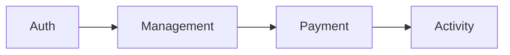

# THis is School management and diary of school management

1.  Professional project architecture
2.  Advanced Error handling
3.  No Sql database (MongoDB)
4.  Query
5.  Aggregation
6.  Transaction & Rollback
7.  Eslint and Prettier
8.  Using Husky for pre-commit checking

# I use here Microservice and Features for this project

1. **Authentication (Auth)**  
   Handles user authentication and authorization.

2. **Management**  
   Responsible for managing user accounts, profiles, and other administrative features.

3. **Payment**  
   Handles all payment-related operations, including transaction processing and billing.

4. **Activity**  
   Tracks and logs user activity within the system.

### Diagram Representation (Optional)

You can include a flow diagram to represent the relationships visually.

## Error Handling Express

Operational Error

- Invalid User Input
- Fail to run server
- Failed to connect DB
- Broken links
  Here I handle this type of error

* Programmatical Error
* unHandled Rejection
* Uncaught Exception

# Also create Global handler for every section

- HandleMongo Validation Error
- HandleMongo Sever Error
- Handle Zod Error
- handle mongo Cast Error
- Api Error handler
